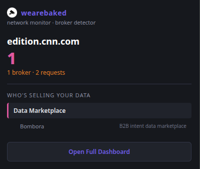
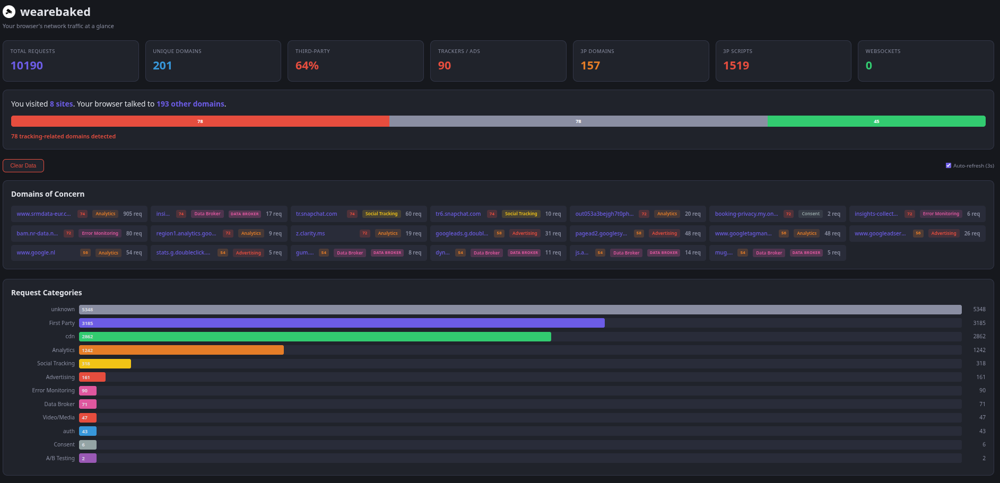

# wearebaked

> See who your browser is talking to — and who's selling your data.

A real-time network traffic dashboard and data broker detector. Every connection your browser makes — categorized, scored, and laid out in a single view. Click the icon for a quick broker verdict, or open the full dashboard to see every request, redirect chain, beacon, and data flow. 550+ known domains, 84 data broker profiles, and three-pass classification — all running locally in your browser.

No data is collected. No data is transmitted. No accounts. No cloud.

## What it detects
- Data brokers active on the current page (Acxiom, LiveRamp, Oracle BlueKai, Criteo, and 80 more)
- Third-party script requests and tracker domains
- Beaconing — domains pinging on a timer
- Redirect chains — when one click bounces through multiple tracking domains
- Data flow — which domains are uploading your data
- WebSocket connections — persistent connections exposed
- Category breakdown: Advertising, Analytics, Fingerprinting, Social Tracking, Data Broker, and more

## Try It Now

Store approval pending — install locally in under a minute:

### Chrome
1. Download this repo (Code → Download ZIP) and unzip
2. Go to `chrome://extensions` and turn on **Developer mode** (top right)
3. Click **Load unpacked** → select the `chrome-extension` folder
4. That's it — browse any site and click the extension icon

### Firefox
1. Download this repo (Code → Download ZIP) and unzip
2. Go to `about:debugging#/runtime/this-firefox`
3. Click **Load Temporary Add-on** → pick any file in the `firefox-extension` folder
4. That's it — browse any site and click the extension icon

> Firefox temporary add-ons reset when you close the browser — just re-load next session.

---

## The weare____ Suite

Privacy tools that show what's happening — no cloud, no accounts, nothing leaves your browser.

| Extension | What it exposes |
|-----------|----------------|
| [wearecooked](https://github.com/hamr0/wearecooked) | Cookies, tracking pixels, and beacons |
| **wearebaked** | Network requests, third-party scripts, and data brokers |
| [weareleaking](https://github.com/hamr0/weareleaking) | localStorage and sessionStorage tracking data |
| [wearelinked](https://github.com/hamr0/wearelinked) | Redirect chains and tracking parameters in links |
| [wearewatched](https://github.com/hamr0/wearewatched) | Browser fingerprinting and silent permission access |
| [weareplayed](https://github.com/hamr0/weareplayed) | Dark patterns: fake urgency, confirm-shaming, pre-checked boxes |
| [wearetosed](https://github.com/hamr0/wearetosed) | Toxic clauses in privacy policies and terms of service |
| [wearesilent](https://github.com/hamr0/wearesilent) | Form input exfiltration before you click submit |

All extensions run entirely on your device and work on Chrome and Firefox.
